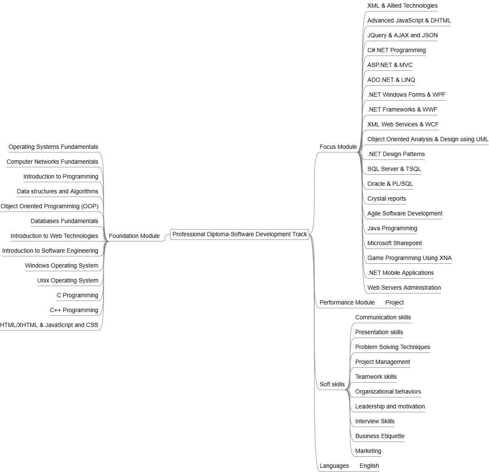

# ITI Professional Diploma - SD Track

Information Technology Institute ([ITI](https://iti.gov.eg/)) — 9-Month Professional Diploma and Training Scholarship Program, Software Engineering Department, Software Development Track (SD).

The program focused on professional software development practices, including .NET Systems & Web Application Development and Database Development, along with soft skills training and hands-on experience with various technical tools and technologies.

### Foundation Module

* Operating Systems Fundamentals
* Computer Networks Fundamentals
* Introduction to Programming
* Data structures and Algorithms
* Object Oriented Programming (OOP)
* Databases Fundamentals
* Introduction to Web Technologies
* Introduction to Software Engineering
* Windows Operating System
* Unix Operating System
* C Programming
* C++ Programming
* HTML/XHTML & JavaScript and CSS

### Focus Module

* XML & Allied Technologies
* Advanced JavaScript & DHTML
* JQuery & AJAX and JSON
* C#.NET Programming
* ASP.NET & MVC
* ADO.NET & LINQ
* .NET Windows Forms & WPF
* .NET Frameworks & WWF
* XML Web Services & WCF
* Object Oriented Analysis & Design using UML
* .NET Design Patterns
* SQL Server & TSQL
* Oracle & PL/SQL
* Crystal reports
* Agile Software Development
* Java Programming
* Microsoft Sharepoint
* Game Programming Using XNA
* .NET Mobile Applications
* Web Servers Administration

### Performance Module (Project)

* [Project](grad-proj.md)

### Soft skills & Languages

* Communication skills
* Presentation skills
* Problem Solving Techniques
* Project Management
* Teamwork skills
* Organizational behaviors
* Leadership and motivation
* Interview Skills
* Business Etiquette
* Marketing
* English