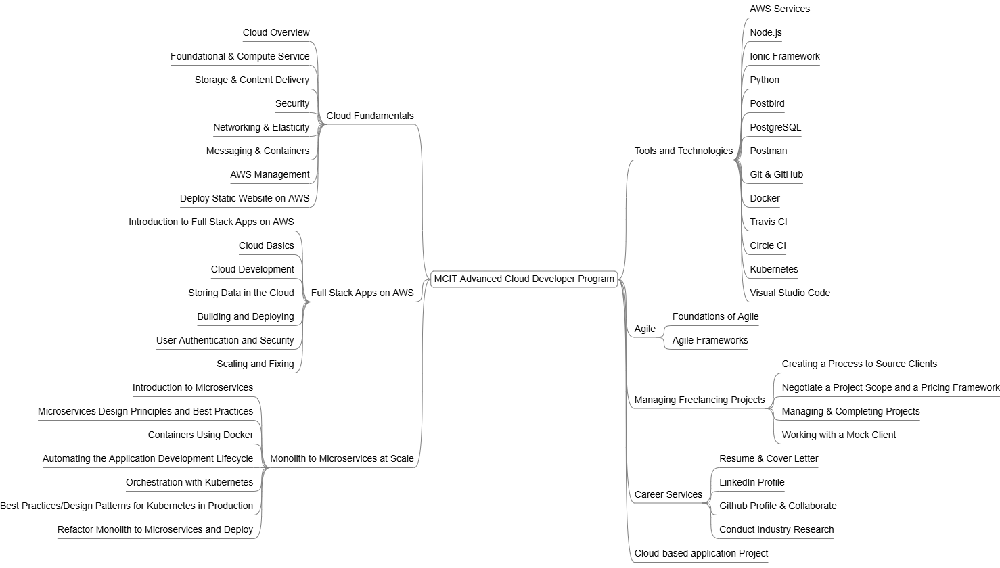

# MCIT Advanced Cloud Developer Nanodegree Program

A 3-Month Advanced Cloud Developer Nanodegree Program under the Future Work is Digital ([EgFWD](https://egfwd.com)) Scholarship, offered by the Ministry of Communications and Information Technology (MCIT), powered by the Information Technology Industry Development Agency ([ITIDA](www.itida.gov.eg)), with [Udacity](www.udacity.com) as the online learning platform.

### Cloud Fundamentals

* Cloud Overview
* Foundational & Compute Service
* Storage & Content Delivery
* Security
* Networking & Elasticity
* Messaging & Containers
* AWS Management
* Deploy Static Website on AWS

### Full Stack Apps on AWS

* Introduction to Full Stack Apps on AWS
* Cloud Basics
* Cloud Development
* Storing Data in the Cloud
* Building and Deploying
* User Authentication and Security
* Scaling and Fixing

### Monolith to Microservices at Scale

* Introduction to Microservices
* Microservices Design Principles and Best Practices
* Containers Using Docker
* Automating the Application Development Lifecycle
* Orchestration with Kubernetes
* Best Practices/Design Patterns for Kubernetes in Production
* Refactor Monolith to Microservices and Deploy

### Tools and Technologies

* AWS Services
* Node.js
* Ionic Framework
* Python
* Postbird
* PostgreSQL
* Postman
* Git & GitHub
* Docker
* Travis CI
* Circle CI
* Kubernetes
* Visual Studio Code

### Agile

* Foundations of Agile
* Agile Frameworks

### Managing Freelancing Projects

* Creating a Process to Source Clients
* Negotiate a Project Scope and a Pricing Framework
* Managing & Completing Projects
* Working with a Mock Client

### Career Services

* Resume & Cover Letter
* LinkedIn Profile
* Github Profile & Collaborate
* Conduct Industry Research

### Project

* Develop a cloud-based application for uploading and filtering images