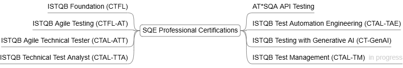

# SQE Professional Certifications

A collection of Software Quality Engineering (SQE) professional certifications syllabi, covering key areas such as Business Domain Testing, Technical Testing, Test Automation, Continuous Testing, and Test Management.

[Software Quality Engineering Key Areas](sqe-areas/README.md)

### ISTQB Foundation Level (CTFL)

- [Syllabus](https://drive.google.com/file/d/1LcwdkSx1lzYnI6lc7b9m5D_ojnaxGNOd/view?usp=drive_link)
- [Verify Certificate — ISTQB SCR](https://scr.istqb.org/) — **Credential ID:** `190620012`

### ISTQB Agile Testing (CTFL-AT)

- [Syllabus](https://drive.google.com/file/d/1H6IzDmTqE9qxKR0Q_G-rQ_t1z7Ho0X-1/view?usp=drive_link)
- [Verify Certificate — ISTQB SCR](https://scr.istqb.org/) — **Credential ID:** `190807012`

### ISTQB Advanced Level Agile Technical Tester (CTAL-ATT)

- [Syllabus](https://drive.google.com/file/d/1NkrlK1gy7rirSRJvOpq59QNDf7_aJvgA/view?usp=drive_link)
- [Verify Certificate — ISTQB SCR](https://scr.istqb.org/) — **Credential ID:** `24-CTAL-ATT-00046-USA`
- [Verify Certificate — AT*SQA](https://atsqa.org/certified-testers/profile/34a9b31a2750421bb3eaf3ccaab67d2b)

### ISTQB Advanced Level Technical Test Analyst (CTAL-TTA)

- [Syllabus](https://drive.google.com/file/d/1B-4zrpB5HbO-qIfSu09SwOYRsJpmUAz6/view?usp=drive_link)
- [Verify Certificate — ISTQB SCR](https://scr.istqb.org/) — **Credential ID:** `25-CTAL-TTA-00007-USA`
- [Verify Certificate — AT*SQA](https://atsqa.org/certified-testers/profile/34a9b31a2750421bb3eaf3ccaab67d2b)

### ISTQB Advanced Level Test Automation Engineering (CTAL-TAE)

- [Syllabus](https://drive.google.com/file/d/1RV-kzekhkGL7lXw6xbMiJu_H2DQnjSTq/view?usp=drive_link)
- [Verify Certificate — ISTQB SCR](https://scr.istqb.org/) — **Credential ID:** `25-CTAL-TAE-00180-USA`
- [Verify Certificate — AT*SQA](https://atsqa.org/certified-testers/profile/34a9b31a2750421bb3eaf3ccaab67d2b)

### AT\*SQA API Testing (AT\*API)

- Syllabus: [Introduction and Testing Planning and Design](https://drive.google.com/file/d/11S-8_q7TYcxJKhihHCAnttDfMe4Qi93L/view?usp=drive_link) | 
[REST API, gRPC, and graphQL](https://drive.google.com/file/d/1c7jQ5bpPqYXCr3r15j-lpqK3ZWjUQ3Mj/view?usp=drive_link) |
[Environments, Tools, and Future Proofing](https://drive.google.com/file/d/1QrxS9aGwyvQR7bMQOJLo4h5Dahy9a5eM/view?usp=drive_link)
- [Verify Certificate — AT*SQA](https://atsqa.org/certified-testers/profile/34a9b31a2750421bb3eaf3ccaab67d2b) — **Credential ID:** `26-AT*API-00013-USA`

### ISTQB Advanced Level Test Management (CTAL-TM)

- [Syllabus](https://drive.google.com/file/d/1fYNixNSCyHWwusIH2iTNEWXQorUznPT9/view?usp=drive_link)